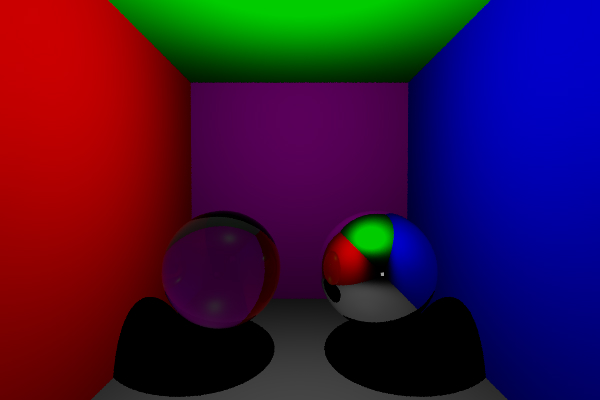

# Isir (Introduction à la synthèse d'images réalistes)

Ray Tracer CPU réalisé au cours de mon master ISICG à l'université de Limoges.

Au cours de cette UE nous avons pu implémenter plusieurs fonctionnalités :

- Sources lumineuse ponctuelles et surfaciques
- Prise en compte des ombres douces et dures
- Prise en charge des textures
- Structure accélératrice BVH et AABB
- BRDF Lambert, Oren-Nayar, Phong, Blinn-Phong, Cook-Torrance
- Réflexion et réfraction
- Surface implicit et sphere tracing

Résultat:

